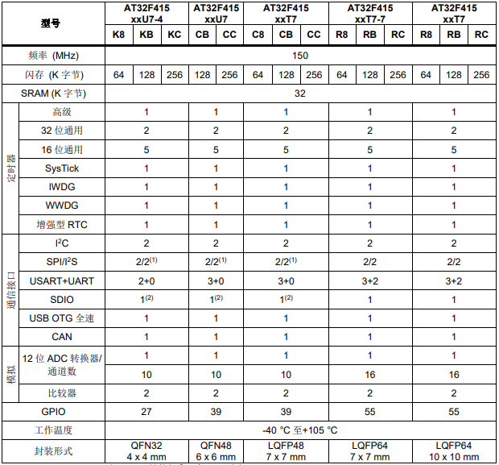

# [AT32F415](https://github.com/SoCXin/AT32F415)

* [arterytek](https://www.arterytek.com/cn/index.jsp): [Cortex-M4](https://github.com/SoCXin/Cortex)
* [L4R3](https://github.com/SoCXin/Level): 150 MHz x 1.25 DMIPS/MHz

## [简介](https://github.com/SoCXin/AT32F415/wiki)

### 关键特性

* Cortex®-M4主频最高 150 MHz
* 3 x USART + 2 x UART
* 1 x CAN 2.0B
* USB 2.0 Device/Host，内置1280 Byte专用SRAM
* 1 x SDIO

### [资源收录](https://github.com/SoCXin/AT32F415)

* [参考资源](src/)
* [参考文档](docs/)
* [参考工程](project/)

### [选型建议](https://github.com/SoCXin)

[AT32F415](https://github.com/SoCXin/AT32F415) 主要特点在于USB OTG功能，定位终端控制类设备32K SRAM限制扩展能力，不具备家族式外部 SPI Flash memory 扩展能力，主频150相对240较低，定位对手STM32F072系列/GD32F350系列。

### [探索芯世界 www.SoC.xin](http://www.SoC.Xin)
